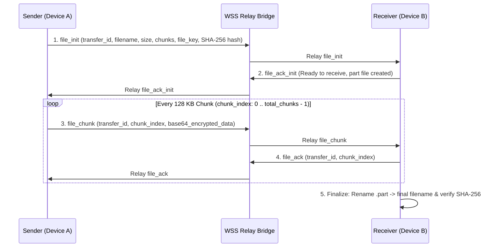

# Vexta-Electron Roadmap & Technical Implementation Guide

This document outlines the detailed architectural blueprint for implementing **Chunked End-to-End Encrypted (E2EE) File Transfer** in Vexta-Electron, maintaining 100% protocol interoperability with Vexta Mobile and Vexta Python clients.

---

## 📁 1. Chunked E2EE File Transfer Architecture

### 1.1 Overview
The file transfer system enables zero-knowledge, encrypted file sharing across the Vexta WebSocket bridge network. To prevent memory exhaustion and support large files (hundreds of MBs), files are split into **128 KB chunks** (`128 * 1024` bytes) and encrypted using ephemeral **AES-GCM 256-bit** keys.



---

## 🔐 2. Cryptographic & Protocol Specification

### 2.1 Encryption & Chunking Specification
- **Chunk Size**: `131072` bytes (128 KB).
- **Symmetric Key**: 32-byte cryptographically secure random key (`crypto.getRandomValues(new Uint8Array(32))`), hex-encoded (`file_key`).
- **Chunk Encryption (`AES-GCM`)**:
  - Each chunk gets a random 12-byte initialization vector (IV/nonce).
  - Ciphertext = `AES-GCM-256.encrypt(nonce, chunk_data, key)`.
  - Wire Format: `Base64(nonce [12 bytes] + ciphertext + auth_tag [16 bytes])`.
- **Integrity Check**: SHA-256 digest of the unencrypted source file calculated before transfer.

### 2.2 Signaling Message Payload Schemas

#### 1. `file_init` (Sender → Receiver)
```json
{
  "type": "file_init",
  "transfer_id": "3f8b91a2c4e57091",
  "filename": "document.pdf",
  "file_size": 1048576,
  "chunk_size": 131072,
  "total_chunks": 8,
  "file_key": "a4f7...3b8d",
  "file_hash": "e3b0c44298fc1c149afbf4c8996fb92427ae41e4649b934ca495991b7852b855"
}
```

#### 2. `file_ack_init` (Receiver → Sender)
```json
{
  "type": "file_ack_init",
  "transfer_id": "3f8b91a2c4e57091"
}
```

#### 3. `file_chunk` (Sender → Receiver)
```json
{
  "type": "file_chunk",
  "transfer_id": "3f8b91a2c4e57091",
  "chunk_index": 0,
  "data": "A9fK...base64_encoded_nonce_plus_ciphertext..."
}
```

#### 4. `file_ack` (Receiver → Sender)
```json
{
  "type": "file_ack",
  "transfer_id": "3f8b91a2c4e57091",
  "chunk_index": 0
}
```

#### 5. `file_cancel` (Either Party → Other Party)
```json
{
  "type": "file_cancel",
  "transfer_id": "3f8b91a2c4e57091",
  "reason": "Cancelled by user"
}
```

---

## 🛠️ 3. Step-by-Step Implementation Blueprint

### Step 3.1: Cryptographic Engine Module (`src/core/file_transfer.ts`)
Create a dedicated TS module managing chunk splitting, Web Crypto AES-GCM 256 encryption/decryption, and SHA-256 verification:
- `encryptFileChunk(arrayBuffer: ArrayBuffer, keyHex: string): Promise<string>`
- `decryptFileChunk(base64Data: string, keyHex: string): Promise<ArrayBuffer>`
- `calculateFileHash(buffer: ArrayBuffer): Promise<string>`

### Step 3.2: Main Process Disk I/O Streaming (`electron/main.cjs`)
Add IPC handlers to perform streaming disk reads/writes to `~/Downloads/Vexta/` without overloading UI memory:
- `ipcMain.handle('read-file-chunk', async (_, { filePath, offset, length }))`
- `ipcMain.handle('write-file-part-chunk', async (_, { transferId, filename, chunkIndex, data }))`
- `ipcMain.handle('finalize-file-transfer', async (_, { transferId, filename, expectedHash }))`

### Step 3.3: WSS Bridge Client Signaling (`src/network/bridge.ts`)
Register frame listeners for `file_init`, `file_ack_init`, `file_chunk`, `file_ack`, and `file_cancel` in `VextaBridgeClient`:
- Emit `vexta_file_transfer_updated` custom events to update React state in real time.

### Step 3.4: Database Storage (`src/crypto/db_manager.ts`)
Add IndexedDB schema table `file_transfers`:
```typescript
export interface DbFileTransfer {
  transferId: string
  contactName: string
  direction: 'send' | 'receive'
  filename: string
  filePath: string
  fileSize: number
  chunkSize: number
  totalChunks: number
  lastAckedChunk: number
  status: 'pending' | 'transferring' | 'completed' | 'failed' | 'cancelled'
  aesKey: string
  fileHash?: string
}
```

### Step 3.5: Chat View & Lightbox UI Integration (`src/screens/ChatView.tsx`)
- Drag-and-drop dropzone overlay for attached files.
- Live progress card showing percent completed, speed (KB/s), pause/resume buttons, and open folder button once completed.

---

## 📋 4. Feature Checklist & Implementation Priority

- [ ] **Phase 1: Crypto & Disk I/O Engine**
  - Implement Web Crypto AES-GCM 128KB chunking in `src/core/file_transfer.ts`.
  - Add IPC streaming file chunk handlers in `electron/main.cjs`.
- [ ] **Phase 2: Protocol Signaling & Database**
  - Add `file_transfers` table in `VextaDatabaseManager`.
  - Wire `file_init`, `file_chunk`, and `file_ack` in `VextaBridgeClient`.
- [ ] **Phase 3: Chat UI & Drag-and-Drop**
  - Add file attachment button and drag-and-drop dropzone in `ChatView.tsx`.
  - Build interactive progress bar cards with SHA-256 integrity verification.
- [ ] **Phase 4: Image EXIF Metadata Scrubbing**
  - Add optional EXIF metadata stripper before sending `.jpg`, `.png`, and `.webp` images.
